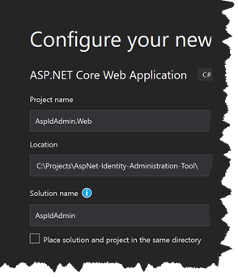

# ASP.NET Identity Administration Tool
Administration tool to manage all the security settings for ASP.NET Identity application. Inspired by [ASP.NET Web Site Administration Tool](https://en.wikipedia.org/wiki/ASP.NET_Web_Site_Administration_Tool).

## Requirements
1. Visual Studio 2019
1. Visual Studio Code *(optional)*
1. SQL Server *(optional)*
1. [ASP.NET Core](https://dotnet.microsoft.com/download)
1. [Node.js](https://nodejs.org/)
1. [Angular CLI](https://cli.angular.io/)

## Create Application from Scratch

* Create ASP.NET Core application with Angular template
  * Project name: `AspIdAdmin.Web`
  * Location: `C:\Projects\AspNet-Identity-Administration-Tool`
  * Solution name: `AspIdAdmin`
  * Authentication: `Individual User Accounts`
* Optional: close the Visual Studio and rename *AspIdAdmin* folder to *src* for Git repository
* Start debugger (F5) in Visual Studio



### Install Angular Material and Flex-Layout

```console
c:\...\AspIdAdmin.Web\ClientApp
λ ng add @angular/material
? Choose a prebuilt theme name...: Indigo/Pink
? Set up global Angular Material typography styles? Yes
? Set up browser animations for Angular Material? Yes

λ npm i @angular/flex-layout --save
```

### Create Angular Modules, Services and Components

```console
c:\...\AspIdAdmin.Web\ClientApp
ng g m angular-material --flat

ng g c shared/sidebar
ng g c shared/header
ng g c shared/footer

ng g m users/user --flat
ng g s users/user --flat
ng g c users/user-list --flat
ng g c users/user-detail --flat
ng g c users/user-edit --flat
```
## Serverside dependencies
System.Linq.Dynamic.Core