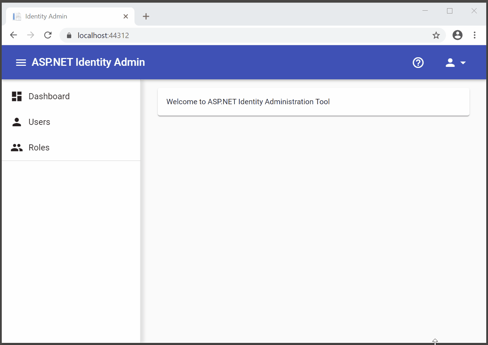

# ASP.NET Identity Administration Tool
Administration tool to manage all the security settings for ASP.NET Identity application. Inspired by [ASP.NET Web Site Administration Tool](https://en.wikipedia.org/wiki/ASP.NET_Web_Site_Administration_Tool).

## Features
- [X] Angular Material layout
- [X] User list page
- [ ] Search by email in user list page
- [ ] User detail page
- [ ] User edit page
- [ ] Role list page
- [ ] Role edit page

Nice to have features
- [ ] Dashboard
- [ ] User login page with Angular Material layout
- [ ] User register page with Angular Material layout

### Features


## Requirements
1. Visual Studio 2019
1. Visual Studio Code *(optional)*
1. SQL Server *(optional)*
1. [ASP.NET Core](https://dotnet.microsoft.com/download)
1. [Node.js](https://nodejs.org/)
1. [Angular CLI](https://cli.angular.io/)

## Create Application from Scratch

* Create ASP.NET Core application with Angular template
  * Project name: `IdentityAdmin.Web`
  * Location: `C:\Projects\AspNet-Identity-Administration-Tool`
  * Solution name: `IdentityAdmin`
  * Authentication: `Individual User Accounts`

* Optional: close the Visual Studio and rename *IdentityAdmin* folder to *src* for Git repository
* Start debugger (F5) in Visual Studio

### Install Angular Material and Flex-Layout

```console
c:\...\IdentityAdmin.Web\ClientApp
λ ng add @angular/material
? Choose a prebuilt theme name...: Indigo/Pink
? Set up global Angular Material typography styles? Yes
? Set up browser animations for Angular Material? Yes

λ npm i @angular/flex-layout@8.0.0-beta.27 --save
```

Note: as of today, the latest `flex-layout@9.0.0-beta.x` is not compitable with Angular 8 so we need to explicitly set the version.

### Create Angular Modules, Services and Components

```console
c:\...\IdentityAdmin.Web\ClientApp
ng g m angular-material --flat

ng g m shared/shared --flat
ng g c shared/sidebar --skip-import
ng g c shared/header --skip-import
ng g c shared/footer --skip-import

ng g m users/user --flat
ng g s users/user --flat
ng g c users/user-list --flat --skip-import
ng g c users/user-detail --flat --skip-import
ng g c users/user-edit --flat --skip-import

ng g m roles/role --flat
ng g s roles/role --flat
ng g c roles/role-list --flat --skip-import
ng g c roles/role-detail --flat --skip-import
ng g c roles/role-edit --flat --skip-import
```

Singletons
```console
ng g m core

ng g m core/alert
ng g s core/alert/alert

ng g m core/modal
ng g s core/modal/modal
ng g c core/modal
```

## Serverside dependencies via NuGet Package
```console
System.Linq.Dynamic.Core
```

## Database migration
* If you use SQL server insidead of local database, create a database (e.g. `IdentityAdmin`) and update the connection string inside `appsettings.json`.
* Inside package manager console, run `PM> Update-Database`.